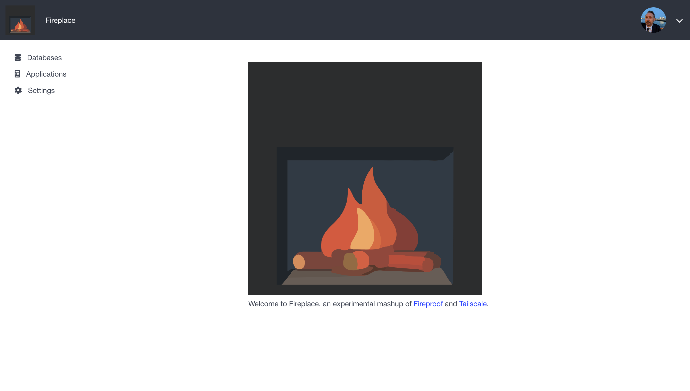
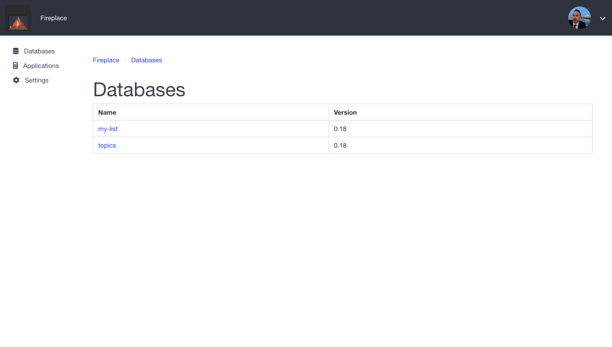
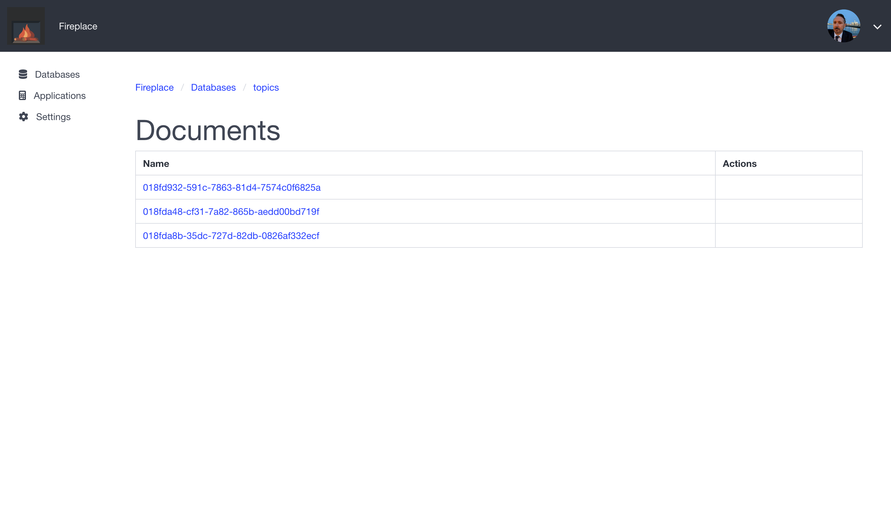
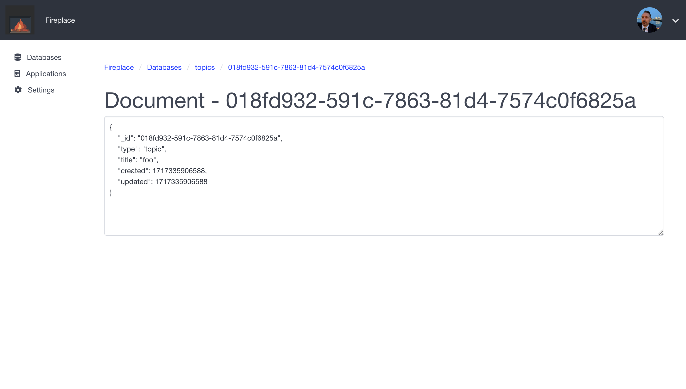

# Fireplace
An experimental mashup of [Fireproof](https://fireproof.storage/) and [Tailscale](https://tailscale.com/).

Fireproof is a next generation database that runs in the browser. 
Tailscale's VPN connects the devices I care about most.
Fireplace makes it trivial to deploy apps to your tailnet that automatically sync data between devices.

## Status

This project is an on-going experiment.
You should NOT use it for production data as it likely contains critical bugs and security vulnerabilities.

## How does it work?

Fireplace has two main functions:
- implement the required APIs to function as a sync endpoint for Fireproof
- host applications via TLS over the tailnet, these applications have built-in access to fireproof sync

### Fireproof Sync API
Fireproof databases support sync through the use of pluggable [cloud connectors](https://use-fireproof.com/docs/database-api/sync#configuring-a-cloud-connector).
Fireplace works by using the [AWS/s3 connector](https://www.npmjs.com/package/@fireproof/aws), with the URLs configured to point to it's own endpoints.
Fireplace implements the required data and metadata storage using the local filesystem of the node running fireplace.
Fireplace implements the websocket notification mechanism, meaning clients are automatically notified of changes and need not manually poll.

### Hosting Apps on your Tailnet

Fireplace uses Tailscale's [tsnet](https://tailscale.com/kb/1244/tsnet) to start a web server connected to your tailnet.
This web server will serve independent applications on a specified hostname.
The fireplace-admin app itself is hosted in this way at (`fireplace.<your-tailnet>.ts.net`).
User's can then deploy their own apps, on their own hostnames, and utilize the built-in fireproof storage.
For example, a shared ToDo application could be configured to be hosted on `todo.your-tailnet.ts.net`.

## Prerequisites

- Must have HTTPS Certificates enabled for your Tailnet
- Might need MagicDNS?  I have it enabled.

## Quick Start

- clone the repo
- `go build`
- Generate an auth key in your [Tailscale Admin Panel](https://login.tailscale.com/admin/settings/keys)
- `export TS_AUTHKEY=<your auth key>`
- `./fireplace`
- Visit`https://fireplace.<your-tailnet>.ts.net/`

## Screenshots






## Fireproof config for Fireplace syncing

This sounds great, but how do I actually configure my app to sync in fireplace?

Use [Fireproof](https://fireproof.storage/) as directed, and simply add the following import:

```javascript
import { connect } from "@fireproof/aws";
```

Then after acquiring your fireproof database add:

```javascript
const s3conf = {
    upload: "https://" + window.location.hostname + '/api/upload',
    download: "https://" + window.location.hostname + '/api/download/',
    websocket: "wss://" + window.location.hostname + '/api/websocket'
}
connect.aws(database, s3conf);
```

## Notes

- Currently Fireplace cannot actually read the database itself.  It simply hosts the means by which you can do so in the browser.  Over time it would be nice to build out the Go implementation, so that fireplace could more meaningfully interact with the data directly.